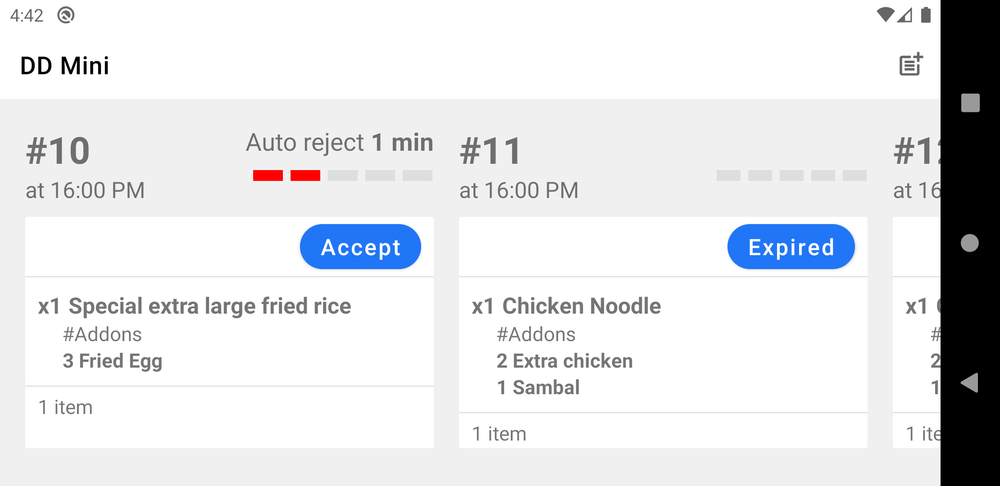
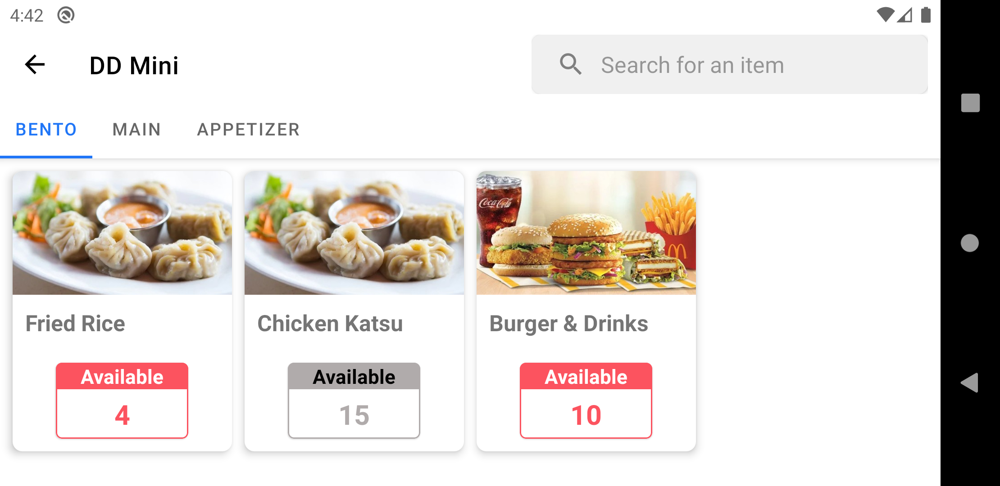
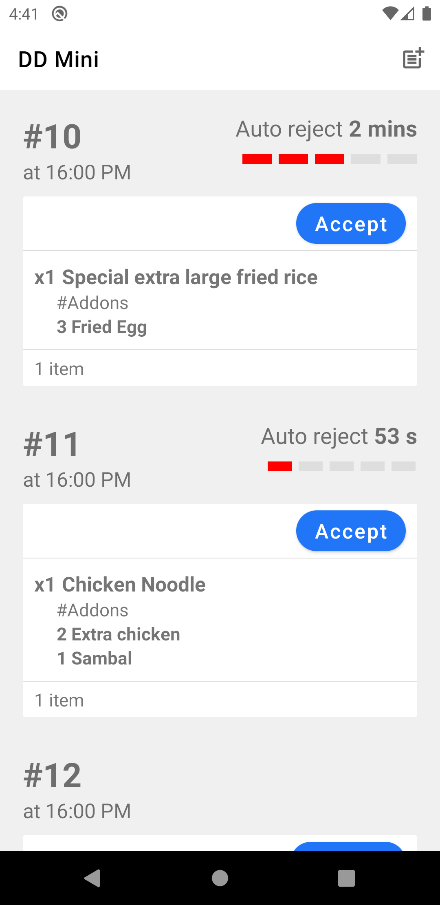

# DinDinn Assignment

This repositiory contains source-code for an android-app entirely based on MVVM architecture with RxJava, Retrofit & Kotlin used as stack and Hilt for dependency-injection.

For more information, check [DD_Mini_Assignment-Android.pdf](https://github.com/adwardstark/dindinn-assignment/blob/master/dd-assignment.pdf)

### Notes

---

 - The network layer is mocked in debug-mode and the data will be loaded from `src/main/assets` directory. You can add/modify items by updating `orders.json` and `ingredients.json` file respectively.

 - Unit tests were not added because the mentioned cases belong to instrumentation tests.

### Screenshots

---

 

 
